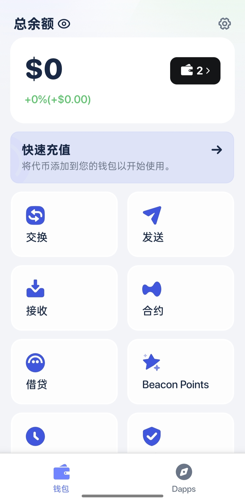
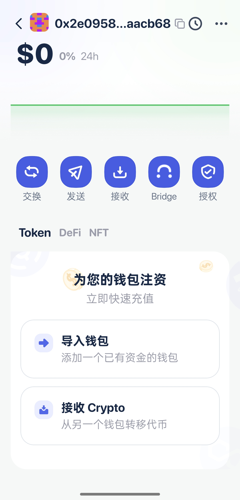
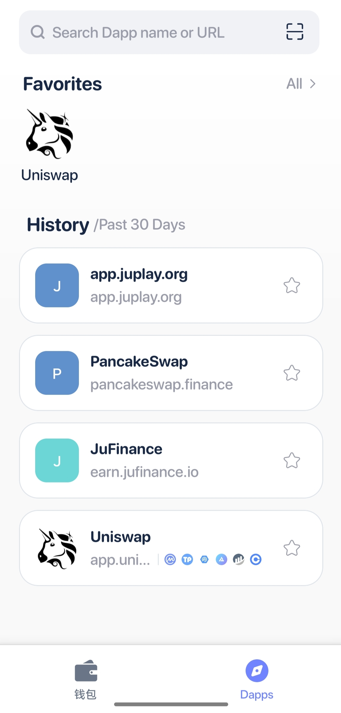
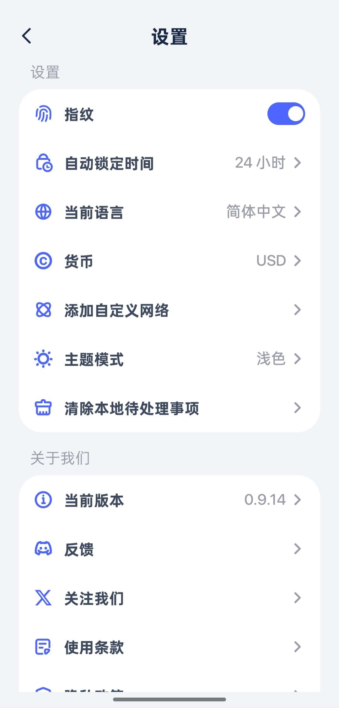
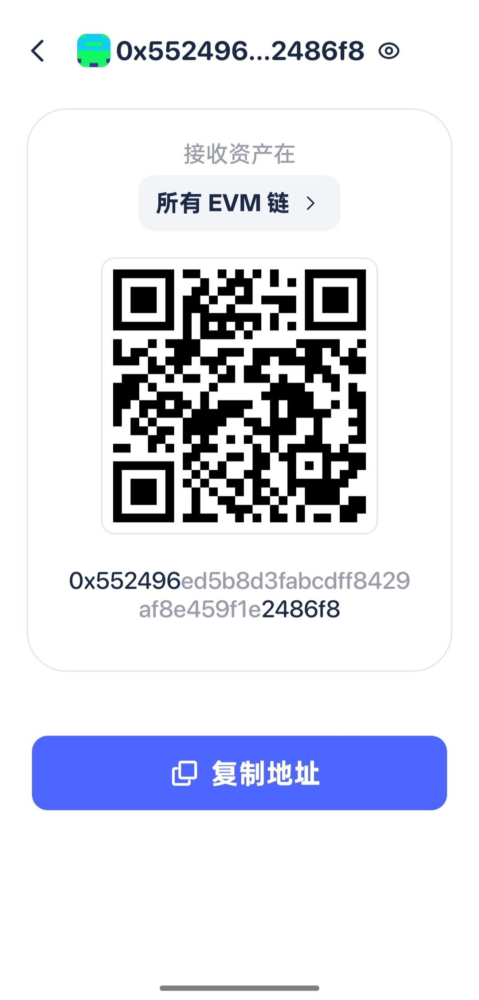
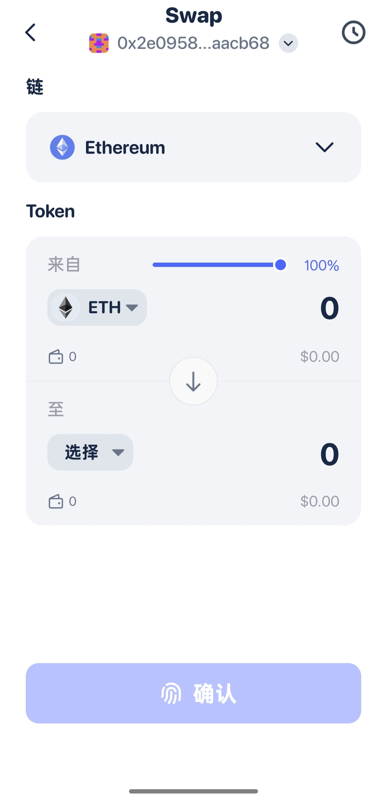
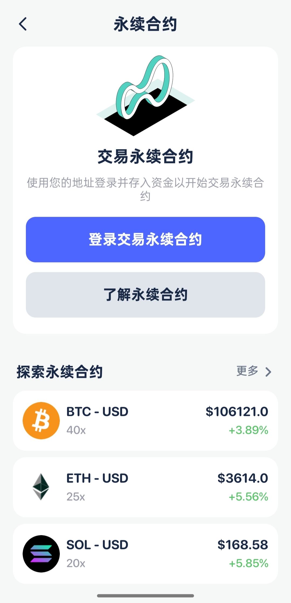
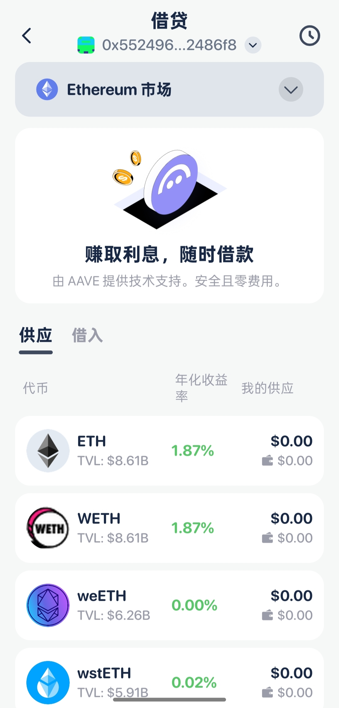
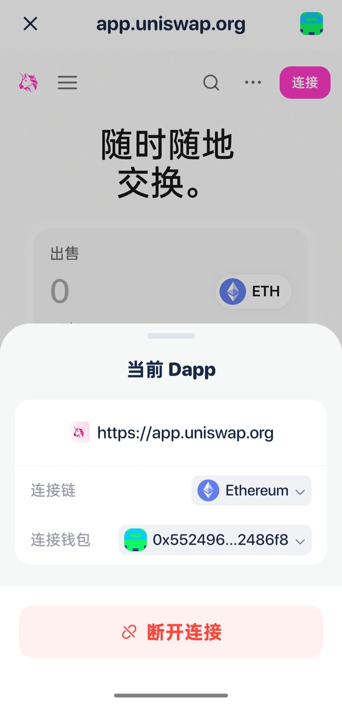

# 🧭 Beacon Wallet：您的 Web3 资产灯塔

> ✨ **安全、极速、开放。面向未来去中心化世界的全功能资产管理与交互平台。**

---

## 🚀 项目简介：掌舵您的数字航程

**Beacon Wallet** 是一款专为 Web3 时代设计的非托管钱包。我们打破传统界限，为您带来极致流畅的用户体验，同时将私钥控制权完全交还给您。

从 DeFi 交易到 NFT 收藏，**Beacon Wallet** 助您安全、自信地探索去中心化宇宙。

## 💡 核心特色一览：为什么选择我们？

我们为您提供 Web3 交互所需的一切工具，让每一次点击都充满力量：

* ### 🏦 资产全景概览 (Dashboard)
    * **一站式管理**：在一个简洁的界面查看所有代币和 NFT 资产余额（[截图 1, 2, 4]）。
    * **交易溯源**：提供完整的、可追溯的链上交易历史记录。

* ### 💰 极速代币兑换 (Swap)
    * **内置 DEX 聚合**：通过简洁的 UI 接口，快速、低滑点地完成代币互换（[截图 3]）。
    * **费率透明**：在执行交易前，清晰展示 Gas 费用和预估滑点。

* ### 🖼️ NFT 收藏家画廊
    * **美观展示**：专为 NFT 收藏设计的沉浸式展示界面（[截图 5]）。
    * **属性校验**：即时查看 NFT 的属性、稀有度以及链上元数据。

* ### 📨 安全收发体验
    * **QR 码支持**：通过二维码快速扫码发送和接收资产，简化操作流程（[截图 6]）。
    * **地址簿**：保存常用地址，告别重复输入，提高交易效率。

* ### 🌐 内置 DApp 浏览器
    * **无缝连接**：通过安全、沙箱化的内置浏览器，轻松连接各类去中心化应用（[截图 8]）。
    * **权限管理**：清晰查看并随时撤销对已连接 DApp 的授权，保障资产安全。

* ### 🛡️ 军事级安全与隐私
    * **非托管**：您的私钥仅加密存储在本地设备上。
    * **多重保护**：支持生物识别（Face ID/Touch ID）和自定义 PIN 码（[截图 9]）。

---

## 📸 界面预览：视觉震撼 (Visual Showcase)

以下是 **Beacon Wallet** 的部分关键界面，所见即所得：

| 模块名称        | 核心功能演示                                 | 截图                                 |
|:------------|:---------------------------------------|:-----------------------------------|
| **主页**      | 主页,📊 资产仪表盘：一览无余地掌握您的全部代币与 NFT 价值                            |   |
| **钱包详情**    | 钱包详情,🛡️ 安全多账户管理：轻松切换地址，查看私钥和助记词信息（高安全级别）                                     |  |
| **Dapp浏览器** | 🌐 Web3 探索入口：内置安全浏览器，无缝连接您喜爱的去中心化应用                                     |  |
| **设置**      | ⚙️ 个性化定制中心：调整安全选项、网络节点、主题和偏好设置                                     |  |
| **资产接收**    | 📥 快速收款码：生成您的专属地址和二维码，一键接收数字资产                                     |  |
| **交易操作**    | ⚡ 一键发送与兑换：简单、直观的发送 (Send) 和代币兑换 (Swap) 界面         |  |
| **永续合约**    | 📈 专业永续交易：直接在钱包内访问和管理去中心化永续合约仓位                                     |  |
| **Aave借贷**  | 💵 Defi 借贷集成：直接参与 Aave 协议，进行资产抵押和借贷操作                                     |  |
| **Uniswap** | 💧 流动性与交易：集成主流 DEX，在 Uniswap 上进行高效的代币交易和流动性提供                                     |  |

*(🚀 探索更多功能，请下载应用体验！)*

---

## ⬇️ 立即启航：如何开始使用？

**Beacon Wallet** 正在等待您的加入！请通过以下渠道获取最新的安装包：

* 📱 **移动端 (推荐)**
    * [App Store 下载 [iOS](https://mobile-app-landing-page-drab.vercel.app/)]
    * [Google Play 下载 [Android](https://mobile-app-landing-page-drab.vercel.app/)]

**🛠️ 开发者指南：**
想要自己编译？请参阅我们的 [BUILDING.md] 文件，获取详细的依赖安装和编译步骤。

---

## 🤝 贡献与社区：加入我们！

您的反馈是驱动 **Beacon Wallet** 持续优化的强大引擎。

* 🐛 **报告 Bug/提交建议**：请在 [GitHub Issues] 页面提交新的 Issue。
* 👨‍💻 **代码贡献**：我们欢迎 Pull Requests！请先阅读 [CONTRIBUTING.md] 文件，了解我们的贡献规范。
* 💬 **加入讨论**：在我们的 Discord 或 Telegram 社区中与其他用户和开发者交流。

## 📄 许可证